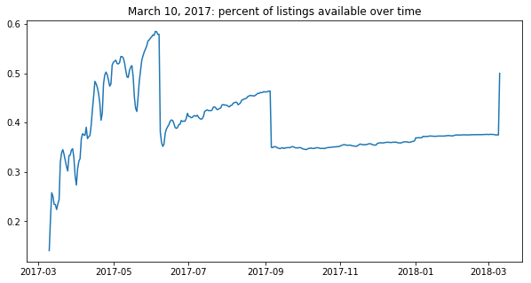
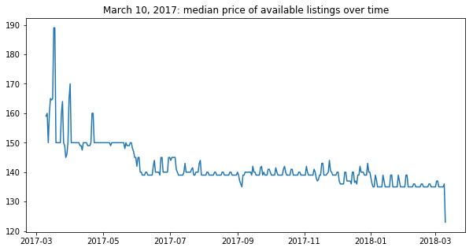

# Capstone: Airbnb in DC - Executive Summary

## Problem:

Build a model to predict prices for Airbnb listings in Washington DC based on features such as size, location, and time of year. Identify the most influential features, with the goal of identifying strategies for Airbnb hosts to maximize profit.

## Data, methods & models:

*   Data: Used data scraped from Airbnb by Inside Airbnb ([http://insideairbnb.com/get-the-data.html](http://insideairbnb.com/get-the-data.html)).
*   Model: Linear regression with regularization (Lasso). Linear regression was chosen for the interpretability of the model, so that the relative impact of various features on the price could be interpreted from the model.
*   Feature Engineering: Data was cleaned, a subset of relevant features was selected, and interaction features were created. Features were scaled. Log transformation was applied to the target variable (price).
*   Python packages used: NumPy, Pandas, Matplotlib.pyplot, Seaborn 
*   Scikit-learn modules used:
    *   from sklearn.model_selection: train_test_split
    *   from sklearn.preprocessing: StandardScaler, PolynomialFeatures
    *   from sklearn.linear_model: LinearRegression, RidgeCV, LassoCV
    *   from sklearn.dummy: DummyRegressor
    *   from sklearn.metrics: mean_squared_error, mean_absolute_error

## Metrics:

*   R2 (coefficient of determination), RMSE (root mean squared error), MAE (mean absolute error)
*   Baseline model: predict the mean price

## Assumptions & Limitations:

*   Inside Airbnb data is accurate.
*   Listings are active
*   LINEI assumptions for linear regression

## Challenges:

*   Time series and missing data imputation: Airbnb prices can be expected to have seasonal variation by both time of year and day of week. Therefore, it would make sense to apply time series modeling techniques to this data. However, the data available to me at this time includes prices for all listings on only a few dates - the dates when data was scraped: 11/15/18, 10/12/18, 9/14/18, 8/18/18, 7/20/18, 5/18/18, 4/15/18, 5/10/17, 3/10/17, 10/3/15. In addition to the listing prices on these dates, calendar data was scraped from the reservation calendar for each listing. However, this calendar data has prices only for the dates when the listing is available. The price is null for dates when the listing is unavailable, approximately 60% of the total dates. Furthermore, it is unknown whether the host set the listing as unavailable on a date or whether it has been booked, and if it was booked, what price it was booked at.
*   Variation in missing data over time: As a first step, I considered using the daily median price of the available listings for a time series model. However, the percentage of missing price data also varies over time. As shown in the graphs below, the percentage of available listings is lower for dates closer to the date the data was scraped, therefore there is a higher percentage of missing prices, causing greater variation in the daily median price. Therefore, I concluded that attempting a time series model for the daily median price of the calendar data would not be useful.

<table>
  <tr>
   <td>

   </td>
  </tr>
  <tr>
   <td>
      
   </td>
  </tr>
  <tr>
   <td>

   </td>
  </tr>
</table>

## Findings:

*   The final model performed better than the baseline (where the baseline predicts the mean price), with R2 of 0.6557 vs R2 of 0 for baseline. However, the MAE (mean absolute error) was \\$94.86, which is a significant error compared to the average predicted price of \\$177.37. More data and more advanced modeling techniques could improve upon this.
*   The number of guests that can be accommodated and other size-related features such as number of bedrooms and bathrooms had the greatest correlation with higher prices. This makes sense as the higher price for a larger Airbnb is divided by more guests sharing the price. Regarding location features, neighborhoods closer to downtown DC had higher positive coefficients than other neighborhoods.
*   Somewhat surprisingly, listings with higher review scores and 'superhost' status were negatively correlated with price. It may be that these listings are more popular and are rented more often, because they provide good value for a lower price. More expensive listings may be getting lower scores if people have higher expectations based on the price. Analysis of the review comments could provide more information on this. It should also be noted that a lower price does not necessarily mean lower total income, as this also depends on the frequency of renting. To maximize profit, an Airbnb host would also want to minimize vacancy on available dates. The cost of owning and maintaining the Airbnb property also factors into the profit calculation.

## Future Improvements:

*   NLP analysis of listing descriptions and review text.
*   Image analysis of listing photos.
*   Geographic data: look at distance from a Metro station and/or distance from the National Mall (or other locations where major tourist events occur).
*   Improve data imputation of missing calendar price data for time series modeling.
*   To get better daily price and reservation data, daily scrapes could be set up to run automatically. We could assume that listings that are available at price x on day 1, then change to unavailable on day 2, were reserved at price x (although it is possible that the host removed the availability).
